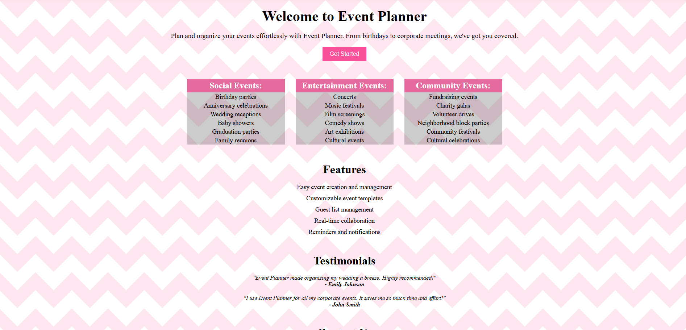

#  Event Planner Landing Page

Welcome to **Event Planner**, a sleek and intuitive landing page built using React. This project simulates a landing page for a service that helps users plan and organize events such as weddings, concerts, charity galas, and more.

##  Features

-  **Event Categories**:
  - Social Events (Weddings, Baby Showers, etc.)
  - Entertainment Events (Concerts, Film Screenings, etc.)
  - Community Events (Charity Galas, Fundraisers, etc.)

- 🛠 **App Features**:
  - Easy event creation and management
  - Customizable templates
  - Guest list management
  - Real-time collaboration
  - Automated reminders and notifications

-  **Testimonials**:
  - Hear from happy users about their experience using Event Planner

##  Tech Stack

- React (Functional Components)
- HTML5 & CSS3
- JSX Syntax
- Modular Component Design
